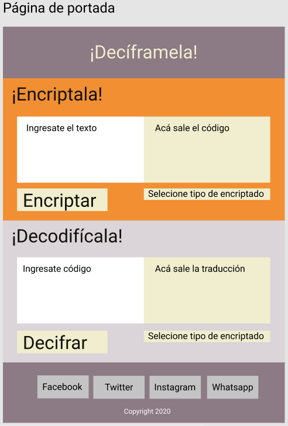

# Proyecto cifrado César: ¡Decíframela!
El cifrado césar es una de las técnicas más simples para cifrar un mensaje. Es un tipo de cifrado por sustitución, es decir que cada letra del texto original es reemplazada por otra que se encuentra un número fijo de posiciones (desplazamiento) más adelante en el mismo alfabeto.

Teniendo eso en mente y buscando información sobre posibles usos del cifrado, surgió la idea de darle uno más jocoso. Considerando la constante interacción de adolescentes y adultos jóvenes en redes sociales, el proyecto ¡Decíframela! busca expandir las formas en que las personas interactúan entregando un nuevo nivel por medio del cifrado.

¡Decíframela! se presenta como un sitio para que amigos puedan cifrar mensajes y publicarlos en sus redes sociales o grupos de conversación, con el fin de poder conversar de manera privada en estas plataformas, pero de forma codificada, lo que causará curiosidad y extrañesa en los que lean los mensajes.

## Interfaz de Usuario

Como la aplicación tiene un fin más de esparcimiento y jocosidad, la interfaz debía ser sencilla, priorizando la usabilidad y simpleza de la misma.  En la primera fase se concibió la idea por medio de un sketch  a mano alzada que presenta la idea base del sitio. Una página única donde se prioriza en tamaño y espacio la funcionalidad de encriptado y descifrado.

 
Luego de armar la maqueta en el sitio, se mantuvo gran parte de la estructura inicial. Pero al ver montado el producto, consideré que era necesario agregar una pequeña descripción del sitio e instrucciones para evitar confusiones respecto al uso. También se modificó la forma en que se puede ingresar la clave numérica para  codificar y decodificar, siendo una etiqueta “input” en vez de una de “selector”.

Considerando lo anterior, el orden lógico de los elementos sería:
- Título y texto explicativo.
- Cajas de texto, la primera donde se escribe el texto a cifrar y la segunda donde se da el resultado.
- Recuadro para ingresar la clave numérica.
- Botones para cifrar y decifrar, repartidos en su sección correspondiente. 
Respecto a la estética del sitio, se eligió una paleta de colores priorizando el color naranja. Esto se debe a las atribuciones que se le asocian a este color como lo son la alegría, la diversión y la sociabilidad. Estas características del color hacen relucir la identidad que se le quiere entregar al sitio. 

## ¿Cómo funciona?

- Escribir o pegar el texto en la primera área del texto.
  
- Escoger clave numérica. De no escogerse, se encuentra el valor de 3 por defecto
 
- Hacer “click” en el botón de encriptado
 
- El resultado se despliegará en la caja correspondiente. Se puede copiar para usar en otros medios.
 
##Para Descifrar:
- Escribir o pegar el texto cifrado en el área de texto.
 
- Digitar la clave numérica que usó la persona que encriptó el mensaje
 
- Hacer click en el botón de decifrado
 
- El resultado se despliegará en la caja de texto 
 
- Opcional: botones para redes sociales, que abren la dirección de la red social.
 

## Por Mejorar…
Para una futura fase del proyecto se espera realizar más testeo con usuarios, para poder ver de qué maneras usan el sitio. Además de mejorar la interfaz del usuario, estos datos pueden ayudar a entender de qué manera los usuarios quieren interactuar con el sitio y cómo van a difundir su uso en redes sociales. 
También se espera poder ampliar el espectro de caracteres que soporta el encriptado, para poder codificar contenido más complejo que requiera el usuario, como espacios, símbolos y acentuaciones. 
Por último, configurar los botones de redes sociales, para que en vez de abrir el sitio de la red, puedan generar una publicación de “compartir” el código encriptado, para poder difundir por redes sociales. 

## Esta página fue construida con:
* HTML
* Javascript
* CSS
## Autores
Javier Chamorro
